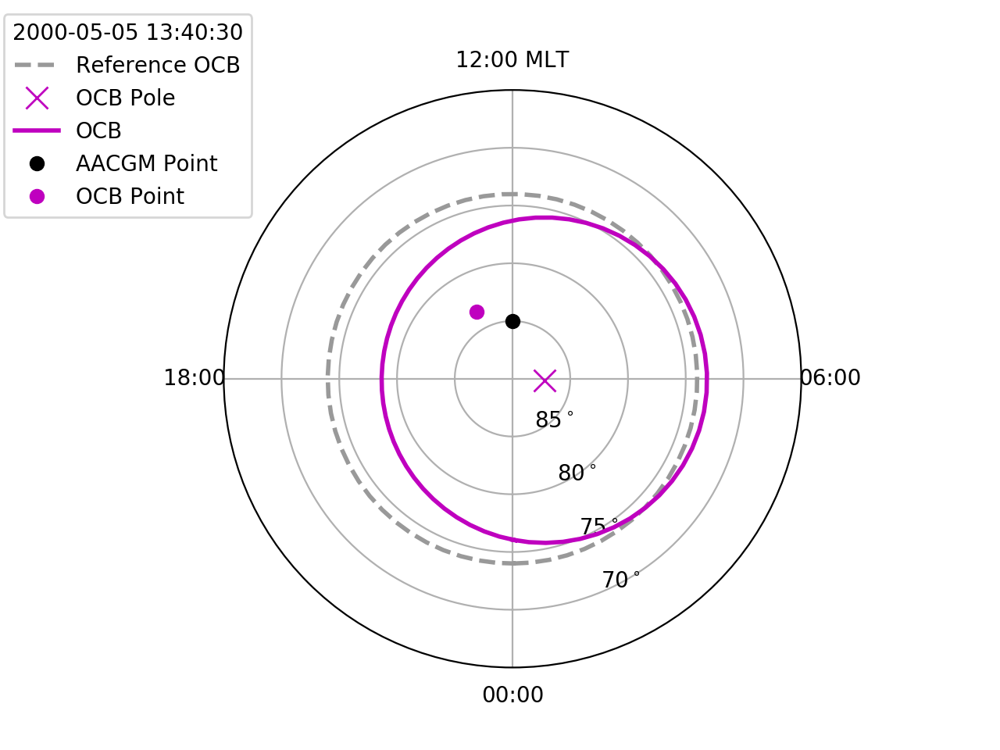

Example
============

Here is a simple example that will show how to initialise an OCBoundary object,
find a trustworthy open-closed boundary, and convert from AACGM coordinates to
OCB coordinates.

Initialise an OCBoundary object
--------------------------------
Start a python or iPython session, and begin by importing ocbpy, numpy,
matplotlib, and datetime.
::
   import numpy as np
   import datetime as dt
   import matplotlib as mpl
   import matplotlib.pyplot as plt
   import ocbpy
  
Next, initialise an OCB class object.  This uses the default IMAGE FUV file and
will take a few minutes to load.
::
   ocb = ocbpy.ocboundary.OCBoundary()
   print ocb
  
   Open-Closed Boundary file: ~/ocbpy/ocbpy/boundaries/si13_north_circle
   Source instrument: IMAGE
   Open-Closed Boundary reference latitude: 74.0 degrees
  
   219927 records from 2000-05-05 11:35:27 to 2002-08-22 00:01:28
  
   YYYY-MM-DD HH:MM:SS Phi_Centre R_Centre R
   -----------------------------------------------------------------------------
   2000-05-05 11:35:27 356.93 8.74 9.69
   2000-05-05 11:37:23 202.97 13.23 22.23
   2002-08-21 23:55:20 322.60 5.49 15.36
   2002-08-22 00:01:28 179.02 2.32 19.52

Retrieve a good OCB record
--------------------------
Get the first good OCB record, which will be record index 27.
::
   ocb.get_next_good_ocb_ind()
   print ocb.rec_ind

To get the OCB record closest to a specified time, use **ocbpy.match_data_ocb**
::
   first_good_time = ocb.dtime[ocb.rec_ind]
   test_times = [first_good_time + dt.timedelta(minutes=5*(i+1)) for i in range(5)]
   itest = ocbpy.match_data_ocb(ocb, test_times, idat=0)
   print itest, ocb.rec_ind, test_times[itest], ocb.dtime[ocb.rec_ind]
  
   0 31 2000-05-05 13:45:30 2000-05-05 13:50:29

Convert between AACGM and OCB coordinates
------------------------------------------
We'll start by visualising the location of the OCB using the first good OCB
in the default IMAGE FUV file.
::
   f = plt.figure()
   ax = f.add_subplot(111, projection="polar")
   ax.set_theta_zero_location("S")
   ax.xaxis.set_ticks([0, 0.5*np.pi, np.pi, 1.5*np.pi])
   ax.xaxis.set_ticklabels(["00:00", "06:00", "12:00 MLT", "18:00"])
   ax.set_rlim(0,25)
   ax.set_rticks([5,10,15,20])
   ax.yaxis.set_ticklabels(["85$^\circ$", "80$^\circ$", "75$^\circ$", "70$^\circ$"]

Mark the location of the circle centre in AACGM coordinates
::
   ocb.rec_ind = 27
   phi_cent_rad = np.radians(ocb.phi_cent[ocb.rec_ind])
   ax.plot([phi_cent_rad], [ocb.r_cent[ocb.rec_ind]], "mx", ms=10, label="OCB Pole")

Calculate at plot the location of the OCB in AACGM coordinates
::
   lon = np.arange(0.0, 2.0 * np.pi + 0.1, 0.1)
   del_lon = lon - phi_cent_rad
   lat = ocb.r_cent[ocb.rec_ind] * np.cos(del_lon) + np.sqrt(ocb.r[ocb.rec_ind]**2 - (ocb.r_cent[ocb.rec_ind] * np.sin(del_lon))**2)
   ax.plot(lon, lat, "m-", linewidth=2, label="OCB")
   ax.text(lon[35], lat[35]+1.5, "74$^\circ$", fontsize="medium", color="m")

Add more reference labels for OCB coordinates.  Since we know the location that
we want to place these labels in OCB coordinates, the **OCBoundary** function
**revert_coord** can be used to get the location in AACGM coordinates.
::
   lon_clock = list()
   lat_clock = list()

   for ocb_mlt in np.arange(0.0, 24.0, 6.0):
       aa,oo = ocb.revert_coord(74.0, ocb_mlt)
       lon_clock.append(oo * np.pi / 12.0)
       lat_clock.append(90.0 - aa)

   ax.plot(lon_clock, lat_clock, "m+")
   ax.plot([lon_clock[0], lon_clock[2]], [lat_clock[0], lat_clock[2]], "-", color="lightpink", zorder=1)
   ax.plot([lon_clock[1], lon_clock[3]], [lat_clock[1], lat_clock[3]], "-", color="lightpink", zorder=1)
   ax.text(lon_clock[2]+.2, lat_clock[2]+1.0, "12:00",fontsize="medium",color="m")
   ax.text(lon[35], olat[35]+1.5, "82$^\circ$", fontsize="medium", color="m")

Now add the location of a point in AACGM coordinates, calculate the
location relative to the OCB, and output both coordinates in the legend
::
   aacgm_lat = 85.0
   aacgm_lon = np.pi
   ocb_lat, ocb_mlt = ocb.normal_coord(aacgm_lat, aacgm_lon * 12.0 / np.pi)
   
   plabel = "Point (MLT, lat)\nAACGM (12:00,85.0$^\circ$)\nOCB ({:.0f}:{:.0f},{:.1f}$^\circ$)".format(np.floor(ocb_mlt), (ocb_mlt - np.floor(ocb_mlt))*60.0, ocb_lat)
   ax.plot([aacgm_lon], [90.0-aacgm_lat], "ko", ms=5, label=plabel)
   
Find the location relative to the current OCB.  Note that the AACGM coordinates
must be in degrees latitude and hours of magnetic local time (MLT).
::
   ocb_lat, ocb_mlt = ocb.normal_coord(aacgm_lat, aacgm_lon * 12.0 / np.pi)
   ax.plot([ocb_mlt * np.pi / 12.0], [90.0 - ocb_lat], "mo", label="OCB Point")

Add a legend to finish the figure.
::
   ax.legend(loc=2, fontsize="small", title="{:}".format(ocb.dtime[ocb.rec_ind]), bbox_to_anchor=(-0.4,1.15))

Scaling of values dependent on the electric potential can be found in the
**ocbpy.ocb_scaling** `module <ocb_gridding.html#ocb-scaling>`__.

Load a test AMPERE OCB file
------------------------------------------
A mock AMPERE file is available in the test directory, containing data for the
southern hemisphere.  Load this data using the following commands.
::
   ocb = ocbpy.ocboundary.OCBoundary(filename="~/ocbpy/ocbpy/tests/test_data/test_south_circle", instrument="ampere", hemisphere=-1)
   print ocb

   Open-Closed Boundary file: tests/test_data/test_south_circle
   Source instrument: AMPERE
   Open-Closed Boundary reference latitude: -72.0 degrees

   14 records from 2010-01-01 00:00:00 to 2010-01-01 00:26:00

   YYYY-MM-DD HH:MM:SS Phi_Centre R_Centre R
   -----------------------------------------------------------------------------
   2010-01-01 00:00:00 296.57 2.24 10.00
   2010-01-01 00:02:00 315.00 2.83 12.00
   2010-01-01 00:24:00 270.00 2.00 10.00
   2010-01-01 00:26:00 270.00 2.00 10.00

Note that the OCB reference latitude is now -72 instead of +74 degrees.  The
sign is specified by the hemisphere keyword and the magnitude of the reference
latitude was set based on the differences in the boundaries measured by
AMPERE and IMAGE FUV.

If you compare the test files for IMAGE FUV and AMPERE, there are more
differences.  The AMPERE data has stored the OCB size and location in Cartesian
coordinates (where the origin lies at the AACGM pole, the x-axis lies along the
dusk-dawn meridian, and the y-axis lies along the midnight-noon meridian), while
the IMAGE data has stored this information in polar coordinates.  The
differences in the two data sets also means that the conditions for evaluating
good OCBs differ.  AMPERE data uses the relative difference in magnitude of the
upward/downward current systems, rather than the number of MLT sectors with
useable information (as IMAGE FUV does).

Any other data file that contains the OCB data in one of the two coordinate
sets can be loaded without any alteration by setting the *instrument* keyword
appropriately.  However, if good boundaries require alternate quantities to be
evaluated (look at the **ocbpy.ocbounary.OCBoundary.get_next_good_ocb_ind**
`routine <ocb_gridding.html#module-ocbpy.ocboundary>`__ for more information),
then modifications will need to be made, or inappropriate boundaries removed
from the input file.

Load a general data file (DMSP)
---------------------------------------------
DMSP SSIES provides commonly used polar data, which can be accessed from the
University of Texas at Dallas `Center for Space Science <http://cindispace.utdallas.edu/DMSP/dmsp_data_at_utdallas.html>`_.  To run this example, follow the
previous link and download the ASCII file for F15 on 23 June 2000 14:08 UT.
This will provide you with a file named **f15_rl001751408.txt**.  To load this
file, use the following commands.
::
   hh = ["YYDDD    SOD  R I   Alt    GLAT   GLONG    MLAT     MLT     Vx     Vy      Vz     RMSx  SigmaY  SigmaZ    Ni_(cm^-3)    Frac_O  Frac_He   Frac_H   Ti     Te      pts"]
   dmsp_filename = "f15_rl001751408.txt"
   dmsp_head, dmsp_data = ocbpy.instruments.general.load_ascii_data(dmsp_filename, 3, datetime_cols=[0,1], datetime_fmt="YYDDD SOD", header=hh, int_cols=[2, 3, 21])

   print dmsp_data['Ti'].shape, dmsp_data.keys()
   
   (1517,) ['GLONG', 'Ti', 'datetime', 'MLAT', 'SigmaY', 'SigmaZ', 'RMSx', 'Te', 'pts', 'SOD', 'Ni_(cm^-3)', 'Frac_H', 'Frac_O', 'Frac_He', 'I', 'GLAT', 'R', 'MLT', 'Vz', 'YYDDD', 'Vx', 'Vy', 'Alt']

In the call to ocbpy.instruments.general.load_ascii_data, quality flags and
number of points are saved as integers by specifying int_cols.  The header
needs to be specified using **header** because the header in the data file,
even though it specifies the data columns in the last line, does not use white
space to only seperate different data column names.

Before calculating the OCB coordinates, add space in the data dictionary for the
OCB coordinates and find out which data have a good quality flag.
::
   dens_key = 'Ni_(cm^-3)'
   dmsp_data['OCB_MLT'] = np.zeros(shape=dmsp_data['Vx'].shape, dtype=float) * np.nan
   dmsp_data['OCB_LAT'] = np.zeros(shape=dmsp_data['Vx'].shape, dtype=float) * np.nan
   igood = [i for i,r in enumerate(dmsp_data['R']) if r < 3 and dmsp_data['I'][i] < 3]
   print len(igood), dmsp_data[dens_key][igood].max(), dmsp_data[dens_key][igood].min()

   702 153742.02 4692.9639

   
Now get the OCB coordinates for each location.  This will not be possible
everywhere, since IMAGE doesn't provide Southern Hemisphere data and only times
with a good OCB established within the last 5 minutes will be used.
::
   idmsp = 0
   ndmsp = len(igood)
   ocb = ocbpy.ocboundary.OCBoundary()
   ocb.get_next_good_ocb_ind()

   while idmsp < ndmsp and ocb.rec_ind < ocb.records:
       idmsp = ocbpy.match_data_ocb(ocb, dmsp_data['datetime'][igood], idat=idmsp, max_tol=600)
       if idmsp < ndmsp and ocb.rec_ind < ocb.records:
           print idmsp, igood[idmsp], ocb.rec_ind
           nlat, nmlt = ocb.normal_coord(dmsp_data['MLAT'][igood[idmsp]], dmsp_data['MLT'][igood[idmsp]])
           dmsp_data['OCB_LAT'][igood[idmsp]] = nlat
           dmsp_data['OCB_MLT'][igood[idmsp]] = nmlt
           idmsp += 1

    igood = [i for i,m in enumerate(dmsp_data['OCB_LAT']) if not np.isnan(m)]
    print len(igood), dmsp_data['OCB_LAT'][igood].max()

    334 78.8453722883

Now, let's plot the satellite track over the pole, relative to the OCB, with
the location accouting for changes in the OCB at a 5 minute resolution.  Note
how the resolution results in apparent jumps in the satellite location.  We
aren't going to plot the ion velocity here, because it is provided in spacecraft
coordinates rather than magnetic coordinates, adding an additional
(and not intensive) level of processing.
::
   f = plt.figure()
   f.suptitle("DMSP F15 in OCB Coordinates")
   ax = f.add_subplot(111, projection="polar")
   ax.set_theta_zero_location("S")
   ax.xaxis.set_ticks([0, 0.5*np.pi, np.pi, 1.5*np.pi])
   ax.xaxis.set_ticklabels(["00:00", "06:00", "12:00 MLT", "18:00"])
   ax.set_rlim(0,40)
   ax.set_rticks([10,20,30,40])
   ax.yaxis.set_ticklabels(["80$^\circ$", "70$^\circ$", "60$^\circ$", "50$^\circ$"])

   lon = np.arange(0.0, 2.0 * np.pi + 0.1, 0.1)
   lat = np.ones(shape=lon.shape) * (90.0 - ocb.boundary_lat)
   ax.plot(lon, lat, "m-", linewidth=2, label="OCB")

   dmsp_lon = dmsp_data['OCB_MLT'][igood] * np.pi / 12.0
   dmsp_lat = 90.0 - dmsp_data['OCB_LAT'][igood]
   dmsp_time = mpl.dates.date2num(dmsp_data['datetime'][igood])
   ax.scatter(dmsp_lon, dmsp_lat, c=dmsp_time, cmap=mpl.cm.get_cmap("Blues"), marker="o", s=10)
   ax.text(10 * np.pi / 12.0, 41, "Start of satellite track")

   

