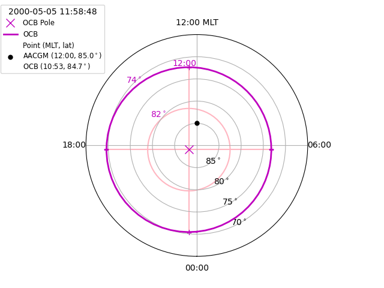
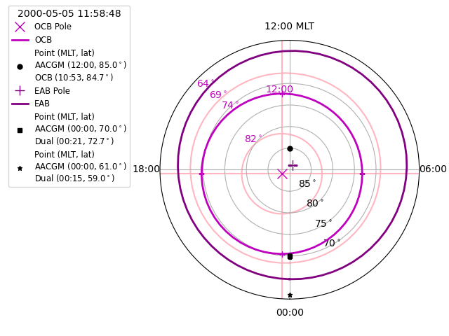

.. _exconvert:

Coordinate Convertion
=====================

All Boundary classes have methods to convert between magnetic, geodetic, or
geographic and normalised boundary coordinates.  When geodetic or geographic
coordinates are provided, :py:mod:`aacgmv2` is used to perform the conversion
at a specified height.

Convert between AACGM and OCB coordinates
-----------------------------------------
We'll start by visualising the location of the OCB using the first good OCB
in the default IMAGE FUV file.

.. _format-polar-axes:

::

   
   def set_up_polar_plot(ax):
       """Set the formatting for a polar plot.

       Parameters
       ----------
       ax : Axes object
           Subplot Axes object to be formatted

       """
       ax.set_theta_zero_location("S")
       ax.xaxis.set_ticks([0, 0.5 * np.pi, np.pi, 1.5 * np.pi])
       ax.xaxis.set_ticklabels(["00:00", "06:00", "12:00 MLT", "18:00"])
       ax.set_rlim(0, 25)
       ax.set_rticks([5, 10, 15, 20])
       ax.yaxis.set_ticklabels(["85$^\circ$", "80$^\circ$", "75$^\circ$",
                                "70$^\circ$"])
       return

   fig = plt.figure()
   ax = fig.add_subplot(111, projection="polar")
   set_up_polar_plot(ax)

Mark the location of the circle centre in AACGM coordinates

::

   # Use the OCB of the first good, paired OCB loaded in the `dual` example
   ocb.rec_ind = dual.ocb_ind[0]
   ax.plot(np.radians(ocb.phi_cent[ocb.rec_ind]), ocb.r_cent[ocb.rec_ind],
           "mx", ms=10, label="OCB Pole")

Calculate and plot the location of the OCB in AACGM coordinates

::

   
   mlt = np.linspace(0.0, 24.0, num=64)
   ocb.get_aacgm_boundary_lat(mlt, rec_ind=ocb.rec_ind)
   theta = ocbpy.ocb_time.hr2rad(mlt)
   rad = 90.0 - ocb.aacgm_boundary_lat[ocb.rec_ind]
   ax.plot(theta, rad, "m-", linewidth=2, label="OCB")
   ax.text(theta[40], rad[40] + 2, "{:.0f}$^\circ$".format(ocb.boundary_lat),
           fontsize="medium", color="m")

Add more reference labels for OCB coordinates.  Since we know the location that
we want to place these labels in OCB coordinates, the
:py:meth:`~ocbpy.OCBoundary.revert_coord` method can be used to get
the location in AACGM coordinates.

::

   # Define a latitude grid for the OCB coordinates
   grid_ocb = 0.5 * (90 - abs(ocb.boundary_lat)) + ocb.boundary_lat
   grid_lat, grid_mlt = ocb.revert_coord(grid_ocb, mlt)
   grid_lat = 90.0 - grid_lat
   grid_theta = grid_mlt * np.pi / 12.0

   # Define the MLT grid in OCB coordinates
   lon_clock = list()
   lat_clock = list()
   for ocb_mlt in np.arange(0.0, 24.0, 6.0):
       aa, oo = ocb.revert_coord(ocb.boundary_lat, ocb_mlt)
       lon_clock.append(oo * np.pi / 12.0)
       lat_clock.append(90.0 - aa)

   # Plot the OCB latitude and MLT grid
   ax.plot(lon_clock, lat_clock, "m+")
   ax.plot([lon_clock[0], lon_clock[2]], [lat_clock[0], lat_clock[2]], "-",
           color="lightpink", zorder=1)
   ax.plot([lon_clock[1], lon_clock[3]], [lat_clock[1], lat_clock[3]], "-",
           color="lightpink", zorder=1)
   ax.plot(grid_theta, grid_lat, "-", color="lightpink", zorder=1)
   ax.text(lon_clock[2] + .2, lat_clock[2] + 1.0, "12:00",fontsize="medium",
           color="m")
   ax.text(grid_theta[40], grid_lat[40] + 2, "{:.0f}$^\circ$".format(grid_ocb),
           fontsize="medium", color="m")

Now add the location of a point in AACGM coordinates, calculate the
location relative to the OCB, and output both coordinates in the legend

::

   
   aacgm_lat = 85.0
   aacgm_theta = np.pi
   ocb_lat, ocb_mlt, _ = ocb.normal_coord(aacgm_lat, aacgm_theta * 12.0 / np.pi)
   
   plabel = "\n".join(["Point (MLT, lat)", "AACGM (12:00, 85.0$^\circ$)",
                       "OCB ({:02.0f}:{:02.0f}, {:.1f}$^\circ$)".format(
                           np.floor(ocb_mlt),
                           (ocb_mlt - np.floor(ocb_mlt)) * 60.0, ocb_lat)])
   ax.plot([aacgm_theta], [90.0 - aacgm_lat], "ko", ms=5, label=plabel)

Add a legend to finish the figure.

::

   
   ax.legend(loc=2, fontsize="small", title="{:}".format(
       ocb.dtime[ocb.rec_ind]), bbox_to_anchor=(-0.4, 1.15))

Scaling of values dependent on the electric potential can be found in the
:py:mod:`ocbpy.ocb_scaling` module.

    
Convert between AACGM and dual-boundary coordinates
---------------------------------------------------
Now let us perform the same visualisation using a paired EAB and OCB.  The
prior example ensured that this was a time with a good dual-boundary for
``dual`` from the prior examples.  Continue by adding the EAB to the existing
figure.

::

   dual.rec_ind = 0
   ax.plot(np.radians(dual.eab.phi_cent[dual.eab.rec_ind]),
                      dual.eab.r_cent[dual.eab.rec_ind],
                      "+", color='purple', ms=10, label="EAB Pole")

Calculate and plot the location of the EAB in AACGM coordinates, expanding
the radial boundaries of the figure as needed.

::

   
   dual.get_aacgm_boundary_lats(mlt, rec_ind=dual.rec_ind, overwrite=True)
   rad = 90.0 - dual.eab.aacgm_boundary_lat[dual.eab.rec_ind]
   ax.plot(theta, rad, "-", color='purple', linewidth=2, label="EAB")
   ax.text(theta[40], rad[40] + 2,
           "{:.0f}$^\circ$".format(dual.eab.boundary_lat), fontsize="medium",
	   color="m")
   ax.set_rmax(np.ceil(max(rad) / 10.0) * 10.0)
   
Add more reference labels for the dual-boundary coordinates.  This is harder to
do, because there is no direct conversion beween the dual-boundary coordinates
and AACGM coordinates without already knowing the AACGM MLT.  To allow forward
and backward transformations, :py:meth:`~ocbpy.DualBoundary.normal_coord` also
returns the OCB coordinates, which can be reverted using
:py:meth:`~ocbpy.DualBoundary.revert_coord`.  Without this knowledge, you must
provide the AACGM MLT.  This is only a barrier for locations equatorward of the
OCB.

::

   # Define a latitude grid midway between the EAB and OCB. Since no locations
   # at or poleward of the OCB are provided, the reversion will only use the
   # shape of the `mlt` arg input.
   grid_eab = 0.5 * (dual.ocb.boundary_lat
                     - dual.eab.boundary_lat) + dual.eab.boundary_lat
   grid_lat, grid_mlt = dual.revert_coord(grid_eab, mlt, aacgm_mlt=mlt,
                                          is_ocb=False)
   grid_lat = 90.0 - grid_lat
   grid_theta = grid_mlt * np.pi / 12.0

   ax.plot(grid_theta, grid_lat, "-", color="lightpink", zorder=1)
   ax.text(grid_theta[40], grid_lat[40] + 2, "{:.0f}$^\circ$".format(grid_eab),
           fontsize="medium", color="m")

   # Extend the MLT grid in dual-boundary coordinates
   fine_mlt = np.linspace(0, 24.0, num=500)
   dual.get_aacgm_boundary_lats(fine_mlt, rec_ind=dual.rec_ind, overwrite=True)
   for i, ocb_mlt in enumerate(np.arange(0.0, 24.0, 6.0)):
       ocb_lat, omlt, _ = dual.ocb.normal_coord(
           dual.eab.aacgm_boundary_lat[dual.eab.rec_ind] - 10.0, fine_mlt)
       j = abs(omlt - ocb_mlt).argmin()
       if ocb_mlt == 0:
           j2 = abs(omlt - 24).argmin()
           if abs(omlt[j2] - ocb_mlt) < abs(omlt[j] - ocb_mlt):
               j = j2

       aa, oo = dual.revert_coord(ocb_lat[j], ocb_mlt)
       lon_outer = oo * np.pi / 12.0
       lat_outer = 90.0 - aa

       ax.plot([lon_clock[i], lon_outer], [lat_clock[i], lat_outer], "-",
               color="lightpink", zorder=1)

Now add the location of two more points in AACGM coordinates, calculating the
dual-boundary location, and output both coordinates in the legend

::

   
   aacgm_lat = [70.0, 61.0]
   aacgm_mlt = 0.0
   bound_lat, bound_mlt, _, _ = dual.normal_coord(aacgm_lat, aacgm_mlt)

   markers = ['s', '*']
   for i, lat in enumerate(aacgm_lat):
       plabel = "\n".join(["Point (MLT, lat)",
                           "AACGM (00:00, {:.1f}$^\circ$)".format(lat),
                           "Dual ({:02.0f}:{:02.0f}, {:.1f}$^\circ$)".format(
                               np.floor(bound_mlt[i]),
                               (bound_mlt[i] - np.floor(bound_mlt[i])) * 60.0,
                               bound_lat[i])])
       fmt = 'k{:s}'.format(markers[i])
       ax.plot([aacgm_mlt * np.pi / 12.0], [90.0 - lat], fmt, ms=5,
               label=plabel)

Update the legend to finish the figure.

::

   fig.subplots_adjust(left=.3, right=.99)
   ax.legend(loc=2, fontsize="small", title="{:}".format(
       dual.dtime[dual.rec_ind]), bbox_to_anchor=(-0.6, 1.15))

