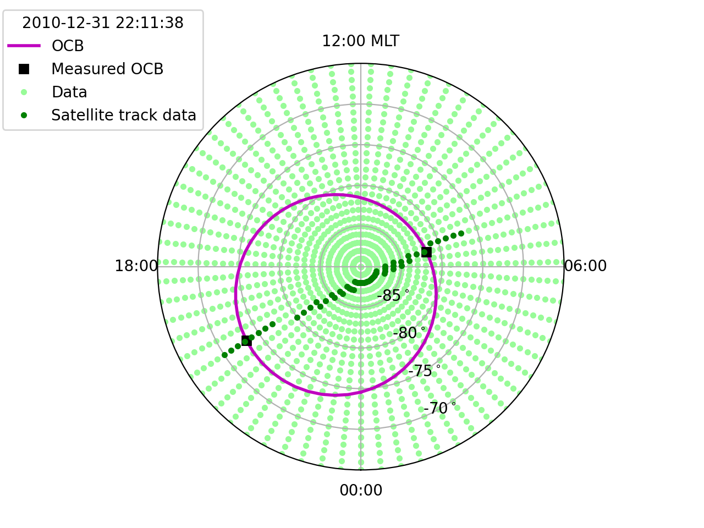

DMSP SSJ Boundaries
===================

For more information about these boundaries, see Section
:ref:`bound-data-dmsp-ssj`.

Loading DMSP SSJ Boundaries
---------------------------
Unlike the IMAGE and AMPERE boundaries, the DMSP SSJ boundaries are not included
with the package. However, routines to obtain them are. To use them, you used to
need the
`ssj_auroral_boundary <https://github.com/lkilcommons/ssj_auroral_boundary>`__
package, but now we preferentially support using the
`zendodo_get <https://github.com/dvolgyes/zenodo_get>`__ package to obtain the
boundary files from their
`archive <https://zenodo.org/record/3373812#.Y-0S3-zMLBt>`__. Once installed,
you can download DMSP SSJ data and obtain a boundary file for a specified time
period (or all available times) using :py:mod:`ocbpy.boundaries.dmsp_ssj_files`.
For this example, we'll use a single day. You can download the files into any
directory, but this example will put them in the same directory as the other
boundary files.

::
   
   import datetime as dt
   import matplotlib.pyplot as plt
   import ocbpy
   import os

   stime = dt.datetime(2010, 12, 31)
   etime = stime + dt.timedelta(days=1)
   out_dir = os.path.join(os.path.split(ocbpy.__file__)[0], "boundaries")

   # Set `use_dep=True` in the function below to use the deprecated subroutines
   bfiles = ocbpy.boundaries.dmsp_ssj_files.fetch_format_ssj_boundary_files(
       stime, etime, out_dir=out_dir, rm_temp=False)

By setting ``rm_temp=False``, all of the different DMSP files will be kept in
the specified output directory.  If you set ``use_dep=True`` you should have
three CDF files (the data downloaded from each DMSP spacecraft), the CSV files
(the boundaries calculated for each DMSP spacecraft) and four boundary files.
Otherwise you will have a zip archive, the CSV files, and the boundary files.
The boundary files have an extention of ``.eab`` for the Equatorial Auroral
Boundary and ``.ocb`` for the Open-Closed field line Boundary.  The files are
separated by hemisphere, and also specify the date range.  Because only one day
was obtained, the start and end dates in the filename are identical.  When
``rm_temp=True``, the zip archive (or CDF files) and CSV files are removed.

You can now load the DMSP SSJ boundaries by specifying the desired filename,
instrument, and hemisphere or merely the instrument and hemisphere.

::
   
   # Load with filename, instrument, and hemisphere
   south_file = os.path.join(out_dir,
                             "dmsp-ssj_south_20101231_20101231_v1.1.2.ocb")
   ocb_south = ocbpy.OCBoundary(filename=south_file, instrument='dmsp-ssj',
                                hemisphere=-1)
   print(ocb_south)

   OCBoundary file: ~/ocbpy/ocbpy/boundaries/dmsp-ssj_south_20101231_20101231_v1.1.2.ocb
   Source instrument: DMSP-SSJ
   Boundary reference latitude: -74.0 degrees

   21 records from 2010-12-31 00:27:23 to 2010-12-31 22:11:38

   YYYY-MM-DD HH:MM:SS Phi_Centre R_Centre R
   -----------------------------------------------------------------------------
   2010-12-31 00:27:23 356.72 14.02 12.13
   2010-12-31 12:27:56 324.82 0.86 14.73
   2010-12-31 18:49:58 233.68 6.12 14.10
   2010-12-31 22:11:38 318.60 4.64 12.34

   Uses scaling function(s):
   ocbpy.ocb_correction.circular(**{})

   # Load with date, instrument, and hemisphere
   ocb_north = ocbpy.OCBoundary(stime=stime, instrument='dmsp-ssj',
                                hemisphere=1)
   print(ocb_north)

   OCBoundary file: ~/ocbpy/ocbpy/boundaries/dmsp-ssj_north_20101231_20101231_v1.1.2.ocb
   Source instrument: DMSP-SSJ
   Boundary reference latitude: 74.0 degrees

   27 records from 2010-12-31 01:19:13 to 2010-12-31 23:02:48

   YYYY-MM-DD HH:MM:SS Phi_Centre R_Centre R
   -----------------------------------------------------------------------------
   2010-12-31 01:19:13 191.07 10.69 8.59
   2010-12-31 06:27:18 195.29 13.52 6.77
   2010-12-31 21:21:32 259.27 2.73 10.45
   2010-12-31 23:02:48 234.73 3.94 10.79

   Uses scaling function(s):
   ocbpy.ocb_correction.circular(**{})

The circular scaling function with no input adds zero the the boundaries, and
so performs no scaling.

Using DMSP SSJ Boundaries
-------------------------

Because DMSP SSJ Boundaries are only measured along a satellite track, you
cannot use these boundaries to convert between magnetic and OCB or Dual-boundary
coordinates at just any location or local time.  To address this issue, the
:py:func:`ocbpy.cycle_boundary.satellite_track` function can be used to
determine whether or not a location is close enough to the satellite track.
This example shows the width along the linear approximation of the satellite
track allowed along the Boundary latitude.  The axis formatting is performed
using the :ref:`set_up_polar_plot <format-polar-axes>` function defined in the
:ref:`exconvert` example.

::

   # Set up the figure
   fig = plt.figure()
   ax = fig.add_subplot(111, projection="polar"
   set_up_polar_plot(ax, hemi=ocb_south.hemisphere)

   # Get the OCB location in AACGM coordinates
   mlt = np.linspace(0, 24, 64)
   ocb_south.get_aacgm_boundary_lat(mlt)

   # Plot the OCB location
   ax.plot(mlt * np.pi / 12.0,
           90 + ocb_south.aacgm_boundary_lat[ocb_south.rec_ind], "m-", lw=2,
	   label="OCB")

   # Deterimine which OCB locations are along the satellite track
   igood = ocbpy.cycle_boundary.satellite_track(
       ocb_south.aacgm_boundary_lat[ocb_south.rec_ind],
       ocb_south.aacgm_boundary_mlt[ocb_south.rec_ind],
       ocb_south.x_1[ocb_south.rec_ind], ocb_south.y_1[ocb_south.rec_ind],
       ocb_south.x_2[ocb_south.rec_ind], ocb_south.y_2[ocb_south.rec_ind],
       hemisphere=ocb_south.hemisphere)
   ax.plot(mlt[igood] * np.pi / 12.0,
           90 + ocb_south.aacgm_boundary_lat[ocb_south.rec_ind][igood], "ks",
           label="Measured OCB")

The default constraints for :py:func:`ocbpy.cycle_boundary.satellite_track`
allow a 1 degree deviation in either Cartesian direction and a maximum distance
of 5 degrees equatorward of the Boundary.

::

   lat = np.arange(-90, -60, 1)
   grid_mlt, grid_lat = np.meshgrid(mlt, lat)
   grid_mlt = grid_mlt.flatten()
   grid_lat = grid_lat.flatten()

   igood = ocbpy.cycle_boundary.satellite_track(
       grid_lat, grid_mlt, ocb_south.x_1[ocb_south.rec_ind],
       ocb_south.y_1[ocb_south.rec_ind], ocb_south.x_2[ocb_south.rec_ind],
       ocb_south.y_2[ocb_south.rec_ind], hemisphere=ocb_south.hemisphere)
   ax.plot(grid_mlt[~igood] * np.pi / 12.0, 90 + grid_lat[~igood], ".",
           color="palegreen", label="Data", zorder=1)
   ax.plot(grid_mlt[igood] * np.pi / 12.0, 90 + grid_lat[igood], "g.",
           label="Satellite track data")
   ax.legend(loc=2, title="{:}".format(ocb_south.dtime[ocb_south.rec_ind]),
             bbox_to_anchor=(-0.4, 1.15))

Note that because the OCB is determined based off of only two points, the OCB
MLT is not very accurate.  **With poorly defined OCBs, we recommend using only
the gridded latitude along the satellite track.**
