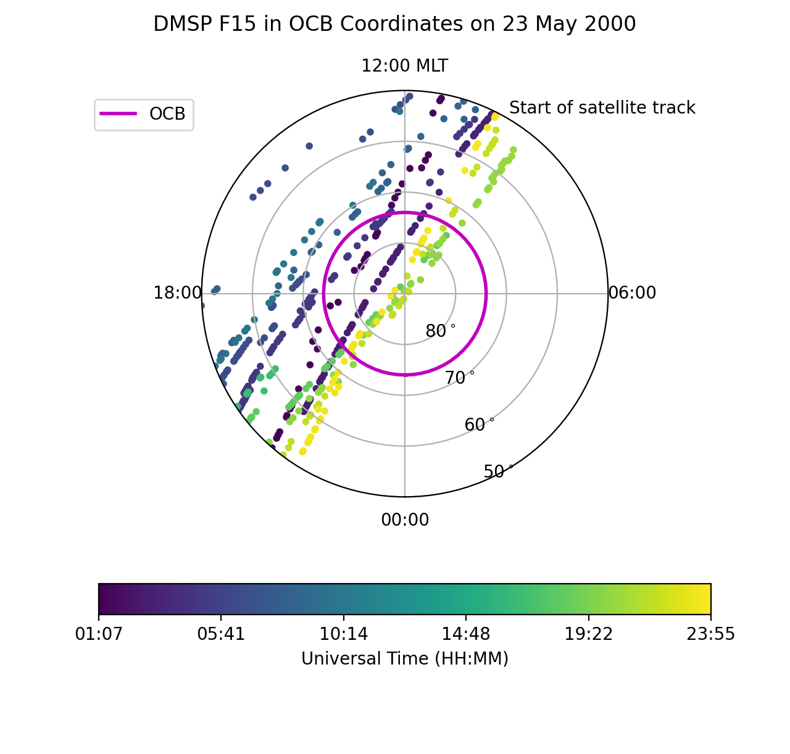

Load a general data file (DMSP SSIES)
---------------------------------------------
DMSP SSIES provides commonly used polar data, which can be accessed from
`Madrigal <http://cedar.openmadrigal.org/>`_, which also has a Python API called
`madrigalWeb <https://pypi.org/project/madrigalWeb/>`_.  To run this example,
follow the previous link(s) and download the ASCII file for F15 on 23 May 2000.
Choosing the UT DMSP with quality flags for the best calcuations of ion drift
and selecting ASCII instead of HDF5 will provide you with a file named
**dms_ut_20000523_15.002.txt**.  To load this file, use the following commands.

::

   
   import datetime as dt
   import numpy as np
   import matplotlib as mlt
   import matplotlib.pyplot as plt
   import ocbpy
   
   hh = ["YEAR     MONTH      DAY       HOUR      MIN       SEC       RECNO     KINDAT      KINST       UT1_UNIX        UT2_UNIX       GDALT      GDLAT      GLON       MLAT         MLT      ION_V_SAT_FOR ION_V_SAT_LEFT VERT_ION_V       NI           PO+           PHE+         PH+        TI         TE     RPA_FLAG_UT IDM_FLAG_UT     RMS_X        SIGMA_VY      SIGMA_VZ"]
   dmsp_filename = "dms_ut_20000423_15.002.txt"
   dmsp_head, dmsp_data = ocbpy.instruments.general.load_ascii_data(dmsp_filename, 1, datetime_cols=[0, 1, 2, 3, 4, 5], header=hh, datetime_fmt="%Y %m %d %H %M %S", int_cols=[6, 7, 8, 25, 26])

   print(dmsp_data['TI'].shape, dmsp_data.keys())
   
   (200060,), ['PH+', 'KINST', 'MIN', 'RPA_FLAG_UT', 'KINDAT', 'datetime', 'MLAT', 'UT2_UNIX', 'ION_V_SAT_FOR', 'ION_V_SAT_LEFT', 'GDALT', 'UT1_UNIX', 'GDLAT', 'HOUR', 'PHE+', 'IDM_FLAG_UT', 'SIGMA_VZ', 'SIGMA_VY', 'SEC', 'RMS_X', 'TI', 'TE', 'DAY', 'GLON', 'NI', 'RECNO', 'PO+', 'MLT', 'YEAR', 'MONTH', 'VERT_ION_V']

In the call to ocbpy.instruments.general.load_ascii_data, quality flags and
number of points are saved as integers by specifying int_cols.  The header
needs to be specified using **header** because, as of the time of publication,
the ASCII header does not correctly specify the ``ION_V_SAT_FOR`` and
``ION_V_SAT_LEFT`` keys, labelling them both ``ION_V_SAT_``.

Before calculating the OCB coordinates, add space in the data dictionary for the
OCB coordinates and find out which data have a good quality flag.

::

   
   ram_key = 'ION_V_SAT_FOR'
   rpa_key = 'RPA_FLAG_UT'
   idm_key = 'IDM_FLAG_UT'
   dmsp_data['OCB_MLT'] = np.full(shape=dmsp_data[ram_key].shape, fill_value=np.nan)
   dmsp_data['OCB_LAT'] = np.full(shape=dmsp_data[ram_key].shape, fill_value=np.nan)
   igood = np.where((dmsp_data[rpa_key] < 3) & (dmsp_data[idm_key] < 3))
   print(len(igood[0]), dmsp_data[ram_key][igood].max(), dmsp_data[ram_key][igood].min())

   7623 978.0 -2159.0

Now get the OCB coordinates for each location.  This will not be possible
everywhere, since IMAGE doesn't provide Southern Hemisphere data and only times
with a good OCB established within the last 5 minutes will be used.

::

   
   idmsp = 0
   ndmsp = len(igood[0])
   ocb = ocbpy.ocboundary.OCBoundary()
   ocb.get_next_good_ocb_ind()

   print(idmsp, ndmsp, ocb.rec_ind, ocb.records)

   0 7623 27 219927

This is the starting point for cycling through the records.

::

   
   while idmsp < ndmsp and ocb.rec_ind < ocb.records:
       idmsp = ocbpy.match_data_ocb(ocb, dmsp_data['datetime'][igood], idat=idmsp, max_tol=600)
       if idmsp < ndmsp and ocb.rec_ind < ocb.records:
           nlat, nmlt, r_corr = ocb.normal_coord(dmsp_data['MLAT'][igood[0][idmsp]], dmsp_data['MLT'][igood[0][idmsp]])
           dmsp_data['OCB_LAT'][igood[0][idmsp]] = nlat
           dmsp_data['OCB_MLT'][igood[0][idmsp]] = nmlt
           idmsp += 1

   igood = np.where(~np.isnan(dmsp_data['OCB_LAT']))
   print(len(igood[0]), dmsp_data['OCB_LAT'][igood].max())

   840 86.77820739248244

Now, let's plot the satellite track over the pole, relative to the OCB, with
the location accouting for changes in the OCB at a 5 minute resolution.  Note
how the resolution results in apparent jumps in the satellite location.  We
aren't going to plot the ion velocity here, because it is provided in spacecraft
coordinates rather than magnetic coordinates, adding an additional
(and not intensive) level of processing.

::

   
   fig = plt.figure()
   fig.suptitle("DMSP F15 in OCB Coordinates on {:}".format(dmsp_data['datetime'][igood][0].strftime('%d %B %Y')))
   ax = fig.add_subplot(111, projection="polar")
   ax.set_theta_zero_location("S")
   ax.xaxis.set_ticks([0, 0.5*np.pi, np.pi, 1.5*np.pi])
   ax.xaxis.set_ticklabels(["00:00", "06:00", "12:00 MLT", "18:00"])
   ax.set_rlim(0,40)
   ax.set_rticks([10,20,30,40])
   ax.yaxis.set_ticklabels(["80$^\circ$", "70$^\circ$", "60$^\circ$", "50$^\circ$"])

   lon = np.arange(0.0, 2.0 * np.pi + 0.1, 0.1)
   lat = np.ones(shape=lon.shape) * (90.0 - ocb.boundary_lat)
   ax.plot(lon, lat, "m-", linewidth=2, label="OCB")

   dmsp_lon = dmsp_data['OCB_MLT'][igood] * np.pi / 12.0
   dmsp_lat = 90.0 - dmsp_data['OCB_LAT'][igood]
   dmsp_time = mpl.dates.date2num(dmsp_data['datetime'][igood])
   ax.scatter(dmsp_lon, dmsp_lat, c=dmsp_time, cmap=mpl.cm.get_cmap("viridis"), marker="o", s=10)
   ax.text(10 * np.pi / 12.0, 41, "Start of satellite track")

   tticks = np.linspace(dmsp_time.min(), dmsp_time.max(), 6, endpoint=True)
   dticks = ["{:s}".format(mpl.dates.num2date(tval).strftime("%H:%M")) for tval in tticks]
   cb = fig.colorbar(ax.collections[0], ax=ax, ticks=tticks, orientation='horizontal')
   cb.ax.set_xticklabels(dticks)
   cb.set_label('Universal Time (HH:MM)')
   ax.legend(fontsize='medium', bbox_to_anchor=(0.0,1.0))

