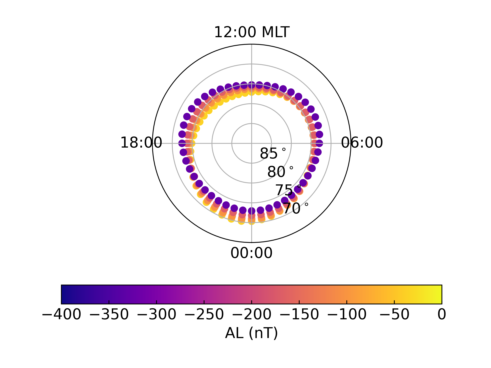
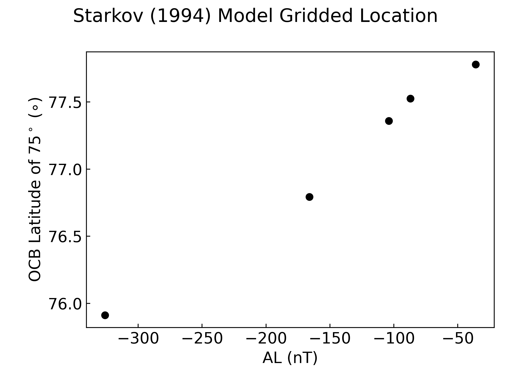

.. _exmodel:

Using Model Boundaries
======================

The boundary models supplied in this package can be used in various ways. The
boundary locations themselves can be calculated for a range of MLTs and
upstream conditions and extracted for various uses. They can also be used to
grid data in adaptive coordinates, as if they were a boundary data set. This may
be useful for statistical studies where sufficient observations of the desired
boundaries are not available.

Calculate Boundary Locations
----------------------------

Following on from the model OCBoundary initialisation example
(see :ref:`exinit-model`), the OCB locations for the desired period of time can
be calculated for a set of MLTs using the
:py:meth:`~ocbpy.OCBoundary.get_aacgm_boundary_lat` method.

::

   import numpy as np
   
   # Define the desired MLT range
   mlt = np.arange(0, 24, 0.5)

   # Calculate the boundaries at all times
   starkov.get_aacgm_boundary_lat(mlt)

This provides the AACGMV2 magnetic latitude for the entire range of MLT at the
specified AL values. We can plot these boundaries, using the formatting function
previously defined in :ref:`set_up_polar_plot <format-polar-axes>`.

::

   # Set up fthe figure
   fig = plt.figure()
   ax = fig.add_subplot(111, projection='polar')
   set_up_polar_plot(ax)

   # Construct an array of AL values to color code the boundaries
   al_array = np.full(shape=(mlt.shape[0], starkov.records),
                      fill_value=al_list).transpose()

   # Plot the boundaries
   con = ax.scatter(np.asarray(starkov.aacgm_boundary_mlt) * np.pi / 12.0,
                    90 - np.asarray(starkov.aacgm_boundary_lat), c=al_array,
		    marker='.', vmin=-400, vmax=0,
		    cmap=mpl.colormaps.get_cmap('plasma'))

   # Add a colorbar
   cb = fig.colorbar(con, ax=ax, orientation='horizontal')
   cb.set_label('AL (nT)')

Calculate Boundary Locations
----------------------------

You can also use these empirical boundaries to grid data. When using models to
do this, be aware that the accuracy of the model will impact the results of any
statistical studies. The example below tracks the location of a location near
the edge of the polar cap at magnetic midnight.

::

   # Ensure the record index iterator is at zero to start
   starkov.rec_ind = 0

   # Cycle through each time and find the OCB location of the magnetic pole
   ocb_lat = list()
   ocb_mlt = list()
   while starkov.rec_ind < starkov.records:
       out = starkov.normal_coord(75.0, 0.0, height=0.0)
       ocb_lat.append(out[0])
       ocb_mlt.append(float(out[1]))
       starkov.rec_ind += 1

   # Note that this model is consistently centred at the same location, so
   # MLT does not change
   print(ocb_mlt)  # Will show all 0.0

   # Plot the change in OCB latitude as a function of AL
   fig = plt.figure()
   ax = fig.add_subplot(111)
   ax.plot([rkwargs['al'] for rkwargs in starkov.rfunc_kwargs], ocb_lat, 'ko')

   # Format the figure
   ax.set_xlabel('AL (nT)')
   ax.set_ylabel('OCB Latitude of 75$^\circ$ ($\circ$)')
   fig.suptitle("Starkov (1994) Model Gridded Location")
   fig.tight_layout()

