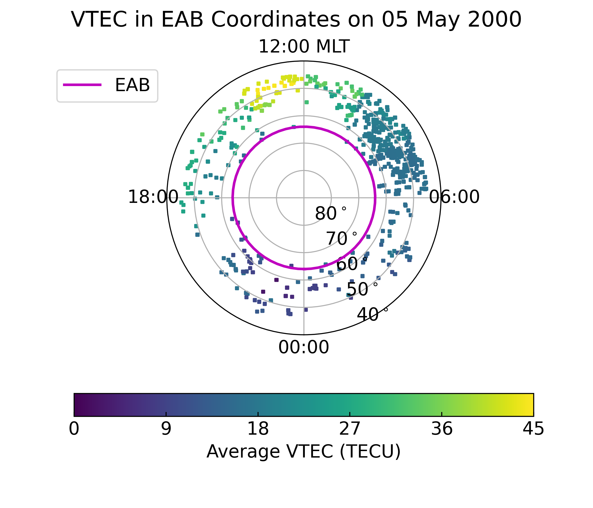

.. _ex_pysat_eab:

A pysat and EAB Example
=======================

This example showcases Equatorward Auroral Boundaries (EABs), while
demonstrating how to use :py:mod:`pysat` with :py:mod:`ocbpy`.

Using Equatorward Auroral Boundaries
------------------------------------
 may be loaded on their own using the
:py:class:`ocbpy.EABoundary` class.  This is a wrapper for the
:py:class:`ocbpy.OCBoundary` class with different defaults more appropriate for
EABs.  Currently, :ref:`bound-data-image` and
:ref:`bound-data-dmsp-ssj` both have EAB data.  This example uses
the default file for IMAGE from the Northern hemisphere.  It is very similar
to :ref:`exinit`, the first example in this section.

::

    import ocbpy

    eab = ocbpy.EABoundary(instrument='image', hemisphere=1)
    print(eab)

    EABoundary file: ~/ocbpy/ocbpy/boundaries/image_north_circle.eab
    Source instrument: IMAGE
    Boundary reference latitude: 64.0 degrees

    305861 records from 2000-05-03 02:41:43 to 2002-10-31 20:05:16

    YYYY-MM-DD HH:MM:SS Phi_Centre R_Centre R
    ------------------------------------------
    2000-05-03 02:41:43 251.57 5.45 14.16
    2000-05-05 11:35:27 111.80 2.34 25.12
    2002-10-31 20:03:16 354.41 6.22 20.87
    2002-10-31 20:05:16 2.87 14.67 13.10

    Uses scaling function(s):
    ocbpy.ocb_correction.circular(**{})

To prepare to use the EAB data, find the time with the first quality boundary.
The expected record index, :py:attr:`eab.rec_ind`, is ``1``.

::

   eab.get_next_good_ocb_ind()

   

Load a pysat Instrument (Madrigal TEC)
--------------------------------------
Total Electron Content (TEC) is one of the most valuable ionospheric data sets.
`Madrigal <http://cedar.openmadrigal.org/>`_ provides Vertical TEC (VTEC) maps
from the 1990's onward that specify the median VTEC in 1 degree x 1 degree
geographic latitude x longitude bins.  The
`pysat <https://github.com/pysat>`_ package,
`pysatMadrigal <https://github.com/pysat/pysatMadrigal>`_
has an instrument for obtaining, managing, and processing this VTEC data. To
run this example, you must have :py:module:`pysatMadrigal`
`installed <https://pysatmadrigal.readthedocs.io/en/latest/installation.html>`_.
After setting up :py:module:`pysat`, download the file needed for this example
using the following commands.

::

   
   import pysat
   import pysatMadrigal as py_mad

   # Replace `user` with a string holding your name and `password` with your
   # email.  Madrigal uses these to demonstrate their utility to funders.
   tec = pysat.Instrumet(inst_module=py_mad.instruments.gnss_tec, tag='vtec',
                         user=user, password=password)
   tec.download(start=eab.dtime[eab.rec_ind])
   print(tec.files.files)

   2000-05-04    gps000504g.001.netCDF4
   2000-05-05    gps000505g.001.netCDF4
   2000-05-06    gps000506g.001.netCDF4
   dtype: object

:py:mod:`pysat` makes it possible to perform well-defined data analysis
prodedures while loading the desired data.  The
:py:mod:`ocbpy.instrument.pysat_instrument` module contains functions that may
be applied using the :py:mod:`pysat` `custom interface
<https://pysat.readthedocs.io/en/latest/tutorial/tutorial_custom.html>`_.
However, before this can be done the magnetic locations need to be calculated.
This can be done by writing an appropriate function that takes the
:py:class:`pysat.Instrument` object as input and updates it within the function.

::

   import aacgmv2
   import numpy as np

   def add_mag_coords(inst, lat='gdlat', lon='glon', alt='gdalt'):
       """Add AACGMV2 magnetic coordinates.

       Parameters
       ----------
       inst : pysat.Instrument
           Data object
       lat : str
           Geodetic latitude key (default='gdlat')
       lon : str
           Geographic longitude key (default='glon')
       alt : str
           Geodetic altitude key (default='gdalt')
       """
       # Initalize the data arrays
       mlat = np.full(shape=tuple(tec.data.dims[kk]
                                  for kk in ['time', lat, lon]),
                      fill_value=np.nan)
       mlt = np.full(shape=mlat.shape, fill_value=np.nan)

       # Cycle through all times, calculating magnetic locations
       for i, dtime in enumerate(inst.index):
           for j, gdlat in enumerate(inst[lat].values):
               height = inst[alt][i, j].values
               if not np.isnan(height).all():
                   mlat[i, j], mlon, r = aacgmv2.convert_latlon_arr(
                       gdlat, inst[lon].values, height, dtime)
                   mlt[i, j] = aacgmv2.convert_mlt(mlon, dtime)

       # Assign the magnetic data to the input Instrument
       inst.data = inst.data.assign({"mlat": (("time", lat, lon), mlat),
                                     "mlt": (("time", lat, lon), mlt)})
       return

    
Assign this function and the ocbpy function in the desired order of operations.

::

   
   tec.custom_attach(add_mag_coords)
   tec.custom_attach(ocbpy.instruments.pysat_instruments.add_ocb_to_data,
                     kwargs={'ocb': eab, 'mlat_name': 'mlat',
                     'mlt_name': 'mlt', 'max_sdiff': 150})
   tec.load(date=eab.dtime[eab.rec_ind])
   print(tec.variables)

   ['time', 'gdlat', 'glon', 'dtec', 'gdalt', 'tec', 'mlat', 'mlt', 'mlat_ocb',
    'mlt_ocb', 'r_corr_ocb']

Now we have the EAB coordinates for each location in the Northern Hemisphere
where a good EAB was found within 2.5 minutes of the data record.  This time
difference was chosen because the VTEC data has a 5 minute resolution.

Now, let's plot the average of the VTEC poleward of the EAB. To do this we will
first need to calculate these averages.

::

   del_lat = 2.0
   del_mlt = 2.0
   ave_lat = np.arange(eab.boundary_lat, 90, del_lat)
   ave_mlt = np.arange(0, 24, del_mlt)
   ave_tec = np.full(shape=tec['tec'].shape, fill_value=np.nan)

   for lat in ave_lat:
       for mlt in ave_mlt:
           # We are not overlapping bins, so don't need to worry about MLT
	   # rollover from 0-24
           sel_tec = tec['tec'].where(
               (tec['mlat_ocb'] > lat) & (tec['mlat_ocb'] <= lat + del_lat)
               & (tec['mlt_ocb'] >= mlt) & (tec['mlt_ocb'] < mlt + del_mlt))
           inds = np.where(~np.isnan(sel_tec.values))
           if len(inds[0]) > 0:
               ave_tec[inds] = np.nanmean(sel_tec.values)

Now let us plot these averages at the EAB location of each measurement.  This
will provide us with knowledge of the coverage as well as knowledge of the
average behaviour.

::

   # Initialise the figure
   fig = plt.figure()
   fig.suptitle("VTEC in EAB Coordinates on {:}".format(
       tec.date.strftime('%d %B %Y')))
   ax = fig.add_subplot(111, projection="polar")
   ax.set_theta_zero_location("S")
   ax.xaxis.set_ticks([0, 0.5 * np.pi, np.pi, 1.5 * np.pi])
   ax.xaxis.set_ticklabels(["00:00", "06:00", "12:00 MLT", "18:00"])
   ax.set_rlim(0, 40)
   ax.set_rticks([10, 20, 30, 40])
   ax.yaxis.set_ticklabels(["80$^\circ$", "70$^\circ$", "60$^\circ$",
                            "50$^\circ$"])

   # Add the boundary location
   lon = np.arange(0.0, 2.0 * np.pi + 0.1, 0.1)
   lat = np.ones(shape=lon.shape) * (90.0 - eab.boundary_lat)
   ax.plot(lon, lat, "m-", linewidth=2, label="EAB")

   # Plot the VTEC data
   tec_lon = tec['mlt_ocb'].values * np.pi / 12.0
   tec_lat = 90.0 - tec['mlat_ocb'].values
   tec_max = np.ceil(np.nanmax(ave_tec))
   con = ax.scatter(tec_lon, tec_lat, c=ave_tec, marker="s",
                    cmap=mpl.cm.get_cmap("viridis"), s=5, vmin=0, vmax=tec_max)

   # Add a colourbar and labels
   tticks = np.linspace(0, tec_max, 6, endpoint=True)
   cb = fig.colorbar(ax.collections[0], ax=ax, ticks=tticks,
                     orientation='horizontal')
   cb.set_label('Average VTEC (TECU)')
   ax.legend(fontsize='medium', bbox_to_anchor=(0.0, 1.0))

