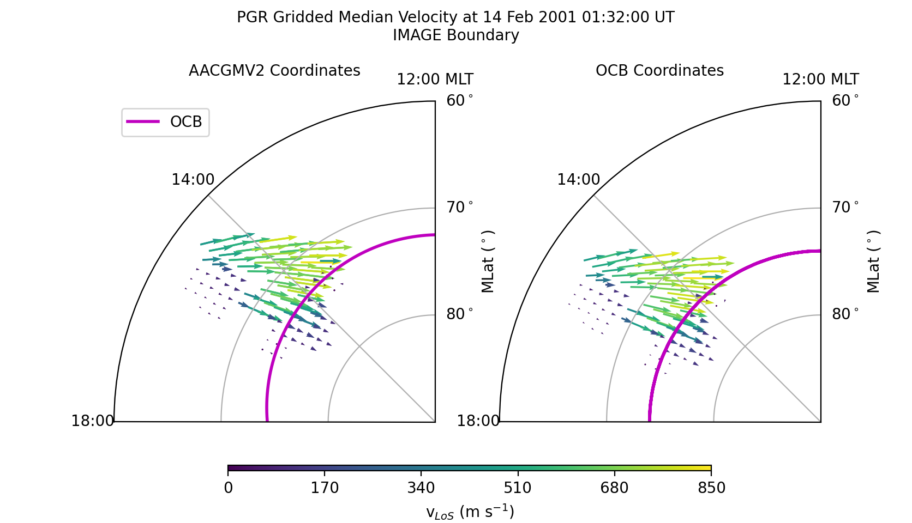

Grid and scale vector data
---------------------------------------------
Many space science observations, such as ion drifts, are vectors.  The
**ocbpy.ocb_scaling.VectorData** class ensures that the vector location,
direction, and magnitude are gridded and scaled appropriately.

The example presented here uses SuperDARN data.  The example file,
*20010214.0100.00.pgr.grd* may be obtained by fitting and then gridding the
rawacf file, available from any of the SuperDARN mirrors.  FitACF v3.0 was used
to create this file.  See the `Radar Software Toolkit <https://radar-software-toolkit-rst.readthedocs.io/en/latest/>`__ for more information.

The SuperDARN data may be read in python using
`pydarn <https://github.com/SuperDARN/pydarn>`__.  To load this file (or any
other grid file), use the following commands.

::

    import datetime as dt
    import numpy as np
    import matplotlib as mpl
    import matplotlib.pyplot as plt

    import aacgmv2
    import ocbpy
    import pydarn

    filename = '20010214.0100.00.pgr.grd'
    sd_read = pydarn.SDarnRead(filename)
    grd_data = sd_read.read_grid()
    print(len(grd_data))

    13

If you used the same file, there will be 13 grid records.  Next, load the OCBs
for the northern hemisphere (PGR is a Canadian radar) and the period of time
available within this file.

::

    stime = dt.datetime(grd_data[0]['start.year'], grd_data[0]['start.month'],
                        grd_data[0]['start.day'], grd_data[0]['start.hour'],
			grd_data[0]['start.minute'],
			int(np.floor(grd_data[0]['start.second'])))
    etime = dt.datetime(grd_data[-1]['start.year'], grd_data[-1]['start.month'],
                        grd_data[-1]['start.day'], grd_data[-1]['start.hour'],
			grd_data[-1]['start.minute'],
			int(np.floor(grd_data[-1]['start.second'])))
    ocb = ocbpy.ocboundary.OCBoundary(stime=stime, etime=etime)
    print(ocb)

    Open-Closed Boundary file: ~/ocbpy/ocbpy/boundaries/si13_north_circle.ocb
    Source instrument: IMAGE
    Open-Closed Boundary reference latitude: 74.0 degrees

    12 records from 2001-02-14 01:33:24 to 2001-02-14 01:55:54

    YYYY-MM-DD HH:MM:SS Phi_Centre R_Centre R
    ------------------------------------------
    2001-02-14 01:33:24 162.58 1.41 16.16
    2001-02-14 01:35:26 176.90 1.77 16.16
    2001-02-14 01:53:51 311.82 2.51 14.44
    2001-02-14 01:55:54 193.16 2.67 15.63

    Uses scaling function(s):
    circular(**{})

To convert this vector into OCB coordinates, we first need to pair the
grid record to an approriate boundary.  In this instance, the first record in
each case is appropriate.

::
    
    ocb.get_next_good_ocb_ind()
    print(ocb.dtime[ocb.rec_ind]-stime)

    0:01:24

If you are using a different file, you can use **ocbpy.match_data_ocb** to
find an appropriate pairing, as illustrated in previous examples.

Now that the data are paired, we can initialize an
**ocbpy.ocb_scaling.VectorData** object.  To do this, however, we need the
SuperDARN LoS velocity data in North-East-Vertical coordinates.  SuperDARN grid
files determine the median magnitude and direction of Line-of-Sight (LoS)
Doppler velocities.  For each period of time, the velocity is expressed in terms
of a median vector magnitude and an angle off of magnetic north.  To convert
between the two, use the following routine.

::

    def kvect_to_ne(kvect, vmag): 
        drifts_n = vmag * np.cos(np.radians(kvect)) 
        drifts_e = vmag * np.sin(np.radians(kvect)) 
        return drifts_e, drifts_n 

    # Calculate the drift components
    drifts_e, drifts_n = kvect_to_ne(grd_data[0]['vector.kvect'],
                                     grd_data[0]['vector.vel.median'])

    # Create an array of the data indices
    dat_ind = np.arange(0, len(grd_data[0]['vector.kvect']))

    # Calculate the magnetic local time from the magnetic longitude
    mlt = aacgmv2.convert_mlt(grd_data[0]['vector.mlon'], stime)

    # Initialize the vector data object
    pgr_vect = ocbpy.ocb_scaling.VectorData(dat_ind, ocb.rec_ind,
                                            grd_data[0]['vector.mlat'], mlt,
					    aacgm_n=drifts_n, aacgm_e=drifts_e,
					    aacgm_mag=grd_data[0]['vector.vel.median'],
					    dat_name='LoS Velocity',
					    dat_units='m s$^{-1}$',
					    scale_func=ocbpy.ocb_scaling.normal_curl_evar)

    # Calculate the OCB coordinates of the vector data
    pgr_vect.set_ocb(ocb)

Because there are 110 vectors at this time and location, printing ``pgr_vect``
will create a long string!  Vector data does not require array input, but does
allow it to reduce the time needed for calculating data observed at the same
time.  A better way to visualise the array of vector velocity data is to plot
it.  The following code will create a figure that shows the AACGMV2
velocities on the left and the OCB velocities on the right.  Because data from
only one radar is plotted, only a fraction of the polar region is plotted.

::

    # Initialize the figure and axes
    fig = plt.figure(figsize([8.36, 4.8]))
    fig.subplots_adjust(wspace=.2, top=.95, bottom=.05)
    axa = fig.add_subplot(1,2,1, projection='polar')
    axo = fig.add_subplot(1,2,2, projection='polar')

    # Format the axes
    xticks = np.linspace(0, 2.0*np.pi, 9) 
    for aa in [axa, axo]: 
        aa.set_theta_zero_location('S') 
        aa.xaxis.set_ticks(xticks) 
        aa.xaxis.set_ticklabels(["{:02d}:00{:s}".format(int(tt), ' MLT'
	                                                if tt == 12.0 else '')
				 for tt in ocbpy.ocb_time.rad2hr(xticks)]) 
        aa.set_rlim(0, 30) 
        aa.set_rticks([10, 20, 30]) 
        aa.yaxis.set_ticklabels(["80$^\circ$", "70$^\circ$", "60$^\circ$"]) 
        aa.set_thetamin(180) 
        aa.set_thetamax(270)
	aa.set_ylabel('MLat ($^\circ$)', labelpad=30)
	aa.yaxis.set_label_position('right')

    fig.suptitle('PGR Gridded Median Velocity at {:} UT\n{:s} Boundary'.format(stime.strftime('%d %b %Y %H:%M:%S'), ocb.instrument.upper()), fontsize='medium')
    axa.set_title('AACGMV2 Coordinates', fontsize='medium')
    axo.set_title('OCB Coordinates', fontsize='medium')

    # Get and plot the OCB
    xmlt = np.arange(0.0, 24.1, .1)
    blat, bmlt = ocb.revert_coord(ocb.boundary_lat, xmlt)
    axa.plot(ocbpy.ocb_time.hr2rad(bmlt), 90.0-blat , 'm-', lw=2, label='OCB') 
    axo.plot(xmlt, 90.0-np.full(shape=xmlt.shape, fill_value=ocb.boundary_lat),
             'm-', lw=2, label='OCB')

    # Get and plot the gridded LoS velocities.  The quiver plot requires these
    # in Cartesian coordinates
    def ne_to_xy(mlt, vect_n, vect_e): 
        theta = ocbpy.ocb_time.hr2rad(mlt) - 0.5 * np.pi 
        drifts_x = -vect_n * np.cos(theta) - vect_e * np.sin(theta) 
        drifts_y = -vect_n * np.sin(theta) + vect_e * np.cos(theta) 
        return drifts_x, drifts_y

    adrift_x, adrift_y = ne_to_xy(mlt, drifts_n, drifts_e)
    odrift_x, odrift_y = ne_to_xy(pgr_vect.ocb_mlt, pgr_vect.ocb_n,
                                  pgr_vect.ocb_e)

    vmin = 0.0
    vmax = 850.0
    vnorm = mpl.colors.Normalize(vmin, vmax)

    axa.quiver(ocbpy.ocb_time.hr2rad(mlt), 90.0-grd_data[i]['vector.mlat'],
               adrift_x, adrift_y, grd_data[i]['vector.vel.median'], norm=vnorm)
    axo.quiver(ocbpy.ocb_time.hr2rad(pgr_vect.ocb_mlt), 90.0-pgr_vect.ocb_lat,
               odrift_x, odrift_y, pgr_vect.ocb_mag, norm=vnorm)

    # Add a colour bar
    cax = fig.add_axes([.25, .1, .53, .01])
    cb = fig.colorbar(axa.collections[0], cax=cax,
                      ticks=np.linspace(vmin, vmax, 6, endpoint=True),
		      orientation='horizontal')
    cb.set_label('v$_{LoS}$ (m s$^{-1}$)')

After displaying or saving this file, the results shoud look like the figure
shown below.  Note how the velocities increase as the beam directions align
more closely with the direction of convection.  However, across all beams the
speeds inside the OCB are slow while those outside (in the auroral oval) are
fast.  The location and direction of the vectors have only shifted to maintain
their position relative to the OCB.  The magnitude has also been scaled, but
the influence is small.

