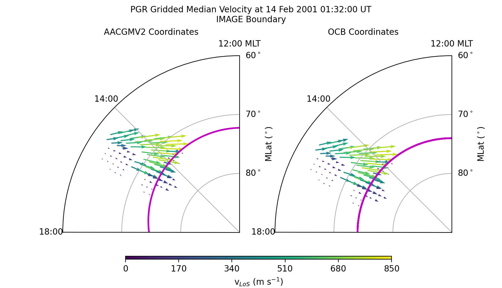
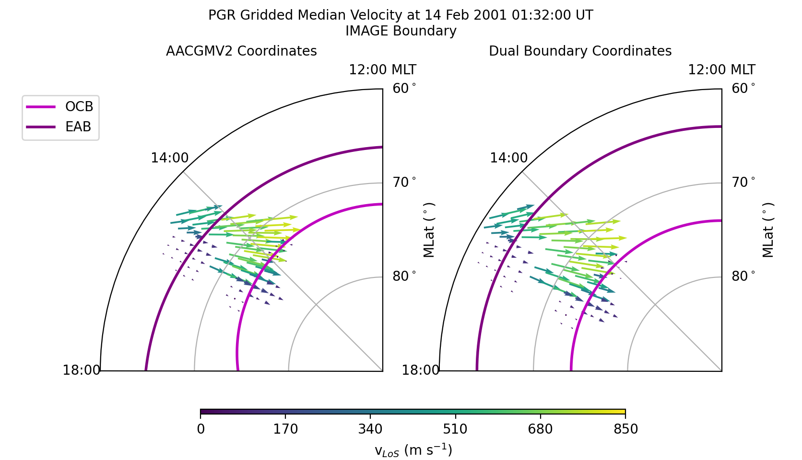

.. _ex-vector:

Grid and scale vector data
==========================

Many space science observations, such as ion drifts, are vectors.  The
:py:class:`ocbpy.ocb_scaling.VectorData` class ensures that the vector location,
direction, and magnitude are gridded and scaled appropriately.

The example presented here uses SuperDARN data.  The example file,
**20010214.0100.00.pgr.grd** may be obtained by fitting and then gridding the
rawacf file, available from any of the SuperDARN mirrors.  FitACF v3.0 was used
to create this file.  See the `Radar Software Toolkit <https://radar-software-toolkit-rst.readthedocs.io/en/latest/>`__ for more information.

The SuperDARN data may be read in python using
`pydarn <https://github.com/SuperDARN/pydarn>`__.  To load this file (or any
other grid file), use the following commands.

::

    import datetime as dt
    import numpy as np
    import matplotlib as mpl
    import matplotlib.pyplot as plt

    import aacgmv2
    import ocbpy
    import pydarn

    filename = '20010214.0100.00.pgr.grd'
    sd_read = pydarn.SuperDARNRead(filename)
    grd_data = sd_read.read_grid()
    print(len(grd_data))

    13

If you used the same file, there will be 13 grid records. Next, load the
appropriate northern hemisphere boundaries (PGR is a Canadian radar).

Single Boundary Transformation
------------------------------

If using only a single boundary with vector data, it is highly recommended that
you use an OCB or OCB proxy rather than an EAB or EAB proxy.  This example shows
how the data period and hemisphere automatically select the most trusted OCB
data set available.

::

    stime = dt.datetime(grd_data[0]['start.year'], grd_data[0]['start.month'],
                        grd_data[0]['start.day'], grd_data[0]['start.hour'],
			grd_data[0]['start.minute'],
			int(np.floor(grd_data[0]['start.second'])))
    etime = dt.datetime(grd_data[-1]['start.year'], grd_data[-1]['start.month'],
                        grd_data[-1]['start.day'], grd_data[-1]['start.hour'],
			grd_data[-1]['start.minute'],
			int(np.floor(grd_data[-1]['start.second'])))
    ocb = ocbpy.OCBoundary(stime=stime, etime=etime)
    print(ocb)

    OCBoundary file: ~/ocbpy/ocbpy/boundaries/image_north_circle.ocb
    Source instrument: IMAGE
    Boundary reference latitude: 74.0 degrees

    12 records from 2001-02-14 01:33:24 to 2001-02-14 01:55:54

    YYYY-MM-DD HH:MM:SS Phi_Centre R_Centre R
    ----------------------------------------------------------------------------
    2001-02-14 01:33:24 169.01 1.94 15.85
    2001-02-14 01:35:26 170.18 1.56 16.47
    2001-02-14 01:53:51 239.81 1.57 15.70
    2001-02-14 01:55:54 210.02 2.09 15.89

    Uses scaling function(s):
    ocbpy.ocb_correction.circular(**{})

To convert this vector into OCB coordinates, we first need to pair the
grid record to an approriate boundary.  In this instance, the first record in
each case is appropriate.

::
    
    ocb.get_next_good_ocb_ind()
    print(ocb.dtime[ocb.rec_ind] - stime)

    0:01:24

If you are using a different file, you can use
:py:func:`~ocbpy.cycle_boundary.match_data_ocb` to find an appropriate pairing,
as illustrated in previous examples.

Now that the data are paired, we can initialise a
:py:class:`ocbpy.ocb_scaling.VectorData` object.  To do this, however, we need
the SuperDARN LoS velocity data in North-East-Vertical coordinates.  SuperDARN
grid files determine the median magnitude and direction of Line-of-Sight (LoS)
Doppler velocities.  For each period of time, the velocity is expressed in terms
of a median vector magnitude and an angle off of magnetic north.  To convert
between the two, use the following routine.

::

    def kvect_to_ne(kvect, vmag): 
        drifts_n = vmag * np.cos(np.radians(kvect)) 
        drifts_e = vmag * np.sin(np.radians(kvect)) 
        return drifts_e, drifts_n 

    # Calculate the drift components
    drifts_e, drifts_n = kvect_to_ne(grd_data[0]['vector.kvect'],
                                     grd_data[0]['vector.vel.median'])

    # Create an array of the data indices
    dat_ind = np.arange(0, len(grd_data[0]['vector.kvect']))

    # Calculate the magnetic local time from the magnetic longitude
    mlt = aacgmv2.convert_mlt(grd_data[0]['vector.mlon'], stime)

    # Initialise the vector data object
    pgr_vect = ocbpy.ocb_scaling.VectorData(
        dat_ind, ocb.rec_ind, grd_data[0]['vector.mlat'], mlt,
        aacgm_n=drifts_n, aacgm_e=drifts_e,
        aacgm_mag=grd_data[0]['vector.vel.median'], dat_name='LoS Velocity',
        dat_units='m s$^{-1}$', scale_func=ocbpy.ocb_scaling.normal_curl_evar)

    # Calculate the OCB coordinates of the vector data
    pgr_vect.set_ocb(ocb)

Because there are 110 vectors at this time and location, printing
:py:data:`pgr_vect` will create a long string!  Vector data does not require
array input, but does allow it to reduce the time needed for calculating data
observed at the same time.  A better way to visualise the array of vector
velocity data is to plot it.  The following code will create a figure that
shows the AACGMV2 velocities on the left and the OCB velocities on the right.
Because data from only one radar is plotted, only a fraction of the polar
region is plotted.

::

    # Initialise the figure and axes
    fig = plt.figure(figsize=([8.36, 4.8]))
    fig.subplots_adjust(wspace=.2, top=.95, bottom=.05)
    axa = fig.add_subplot(1, 2, 1, projection='polar')
    axo = fig.add_subplot(1, 2, 2, projection='polar')

    # Format the axes
    xticks = np.linspace(0, 2.0 * np.pi, 9) 
    for aa in [axa, axo]: 
        aa.set_theta_zero_location('S') 
        aa.xaxis.set_ticks(xticks) 
        aa.xaxis.set_ticklabels(["{:02d}:00{:s}".format(int(tt), ' MLT'
	                                                if tt == 12.0 else '')
				 for tt in ocbpy.ocb_time.rad2hr(xticks)]) 
        aa.set_rlim(0, 30) 
        aa.set_rticks([10, 20, 30]) 
        aa.yaxis.set_ticklabels(["80$^\circ$", "70$^\circ$", "60$^\circ$"]) 
        aa.set_thetamin(180) 
        aa.set_thetamax(270)
	aa.set_ylabel('MLat ($^\circ$)', labelpad=30)
	aa.yaxis.set_label_position('right')

    fig.suptitle(
        'PGR Gridded Median Velocity at {:} UT\n{:s} Boundary'.format(
	    stime.strftime('%d %b %Y %H:%M:%S'), ocb.instrument.upper()),
	fontsize='medium')
    axa.set_title('AACGMV2 Coordinates', fontsize='medium')
    axo.set_title('OCB Coordinates', fontsize='medium')

    # Get and plot the OCB
    xmlt = np.arange(0.0, 24.1, .1)
    blat, bmlt = ocb.revert_coord(ocb.boundary_lat, xmlt)
    axa.plot(ocbpy.ocb_time.hr2rad(bmlt), 90.0 - blat , 'm-', lw=2, label='OCB')
    axo.plot(ocbpy.ocb_time.hr2rad(xmlt),
             90.0 - np.full(shape=xmlt.shape, fill_value=ocb.boundary_lat),
             'm-', lw=2, label='OCB')

    # Get and plot the gridded LoS velocities.  The quiver plot requires these
    # in Cartesian coordinates
    def ne_to_xy(mlt, vect_n, vect_e): 
        theta = ocbpy.ocb_time.hr2rad(mlt) - 0.5 * np.pi 
        drifts_x = -vect_n * np.cos(theta) - vect_e * np.sin(theta) 
        drifts_y = -vect_n * np.sin(theta) + vect_e * np.cos(theta) 
        return drifts_x, drifts_y

    adrift_x, adrift_y = ne_to_xy(mlt, drifts_n, drifts_e)
    odrift_x, odrift_y = ne_to_xy(pgr_vect.ocb_mlt, pgr_vect.ocb_n,
                                  pgr_vect.ocb_e)

    vmin = 0.0
    vmax = 850.0
    vnorm = mpl.colors.Normalize(vmin, vmax)

    axa.quiver(ocbpy.ocb_time.hr2rad(mlt), 90.0 - grd_data[0]['vector.mlat'],
               adrift_x, adrift_y, grd_data[0]['vector.vel.median'], norm=vnorm)
    axo.quiver(ocbpy.ocb_time.hr2rad(pgr_vect.ocb_mlt), 90.0 - pgr_vect.ocb_lat,
               odrift_x, odrift_y, pgr_vect.ocb_mag, norm=vnorm)

    # Add a colour bar
    cax = fig.add_axes([.25, .1, .53, .01])
    cb = fig.colorbar(axa.collections[0], cax=cax,
                      ticks=np.linspace(vmin, vmax, 6, endpoint=True),
		      orientation='horizontal')
    cb.set_label('v$_{LoS}$ (m s$^{-1}$)')

After displaying or saving this file, the results shoud look like the figure
shown below.  Note how the velocities increase as the beam directions align
more closely with the direction of convection.  However, across all beams the
speeds inside the OCB are slow while those outside (in the auroral oval) are
fast.  The location and direction of the vectors have only shifted to maintain
their position relative to the OCB.  The magnitude has also been scaled, but
the influence is small.

Dual Boundary Transformation
----------------------------

Now let us transform the same data using both the EAB and OCB.

::

   dual = ocbpy.DualBoundary(stime=stime, etime=etime)
   print(dual)

   Dual Boundary data
   11 good boundary pairs from 2001-02-14 01:33:24 to 2001-02-14 01:55:54
   Maximum  boundary difference of 60.0 s

   EABoundary file: ~/ocbpy/ocbpy/boundaries/image_north_circle.eab
   Source instrument: IMAGE
   Boundary reference latitude: 64.0 degrees

   12 records from 2001-02-14 01:33:24 to 2001-02-14 01:55:54

   YYYY-MM-DD HH:MM:SS Phi_Centre R_Centre R
   -----------------------------------------------------------------------------
   2001-02-14 01:33:24 26.27 3.24 26.76
   2001-02-14 01:35:26 26.54 3.59 26.53
   2001-02-14 01:53:51 9.72 4.20 26.37
   2001-02-14 01:55:54 13.46 3.06 26.78

   Uses scaling function(s):
   ocbpy.ocb_correction.circular(**{})

   OCBoundary file: ~/ocbpy/ocbpy/boundaries/image_north_circle.ocb
   Source instrument: IMAGE
   Boundary reference latitude: 74.0 degrees

   12 records from 2001-02-14 01:33:24 to 2001-02-14 01:55:54

   YYYY-MM-DD HH:MM:SS Phi_Centre R_Centre R
   -----------------------------------------------------------------------------
   2001-02-14 01:33:24 169.01 1.94 15.85
   2001-02-14 01:35:26 170.18 1.56 16.47
   2001-02-14 01:53:51 239.81 1.57 15.70
   2001-02-14 01:55:54 210.02 2.09 15.89

   Uses scaling function(s):
   ocbpy.ocb_correction.circular(**{})

For the :py:class:`~ocbpy._boundary.DualBoundary` class, we don't need to
initialise the first good record index.  However, if you are using a different
file, you should use :py:func:`~ocbpy.cycle_boundary.match_data_ocb` to find an
appropriate pairing before continuing.

Because we are paired, we can re-initialise a
:py:class:`ocbpy.ocb_scaling.VectorData` object.  To do this, however, we need
the SuperDARN LoS velocity data in North-East-Vertical coordinates.  SuperDARN
grid files determine the median magnitude and direction of Line-of-Sight (LoS)
Doppler velocities.  For each period of time, the velocity is expressed in terms
of a median vector magnitude and an angle off of magnetic north.  To convert
between the two, use the following routine.

::

    # Re-initialise the vector data object
    pgr_vect = ocbpy.ocb_scaling.VectorData(
        dat_ind, dual.rec_ind, grd_data[0]['vector.mlat'], mlt,
        aacgm_n=drifts_n, aacgm_e=drifts_e,
        aacgm_mag=grd_data[0]['vector.vel.median'], dat_name='LoS Velocity',
        dat_units='m s$^{-1}$', scale_func=ocbpy.ocb_scaling.normal_curl_evar)

    # Calculate the dual-boundary coordinates of the vector data
    pgr_vect.set_ocb(dual)

Now let us update the current figure with the new data.

::

    # Remove the data from the OCB coordinate axis
    axa.lines.pop()  # Remove the OCB
    axo.lines.pop()  # Remove the OCB
    axo.collections.pop()  # Remove the vectors
    axo.set_title('Dual Boundary Coordinates', fontsize='medium')

    # Get and plot the OCB and EAB
    xmlt = np.arange(0.0, 24.1, .1)
    dual.get_aacgm_boundary_lats(xmlt, rec_ind=dual.rec_ind, overwrite=True)
    axa.plot(ocbpy.ocb_time.hr2rad(
        dual.ocb.aacgm_boundary_mlt[dual.ocb.rec_ind]),
             90.0 - dual.ocb.aacgm_boundary_lat[dual.ocb.rec_ind], 'm-',
             lw=2, label='OCB')
    axa.plot(ocbpy.ocb_time.hr2rad(
        dual.eab.aacgm_boundary_mlt[dual.eab.rec_ind]),
             90.0 - dual.eab.aacgm_boundary_lat[dual.eab.rec_ind], '-',
             lw=2, color='purple', label='EAB')
    axo.plot(ocbpy.ocb_time.hr2rad(xmlt),
             90.0 - np.full(shape=xmlt.shape, fill_value=dual.ocb.boundary_lat),
             'm-', lw=2, label='OCB')
    axo.plot(ocbpy.ocb_time.hr2rad(xmlt),
             90.0 - np.full(shape=xmlt.shape, fill_value=dual.eab.boundary_lat),
             '-', lw=2, color='purple', label='EAB')

    # Add the dual-boundary quivers
    axo.quiver(ocbpy.ocb_time.hr2rad(pgr_vect.ocb_mlt), 90.0 - pgr_vect.ocb_lat,
               odrift_x, odrift_y, pgr_vect.ocb_mag, norm=vnorm)

    # Add a legend
    axa.legend(fontsize='medium', loc=2, bbox_to_anchor=(-.3, 1.0))

After displaying or saving this file, the results shoud look like the figure
shown below.  The biggest difference between the dual and single boundary
results are the locations in the auroral oval.

